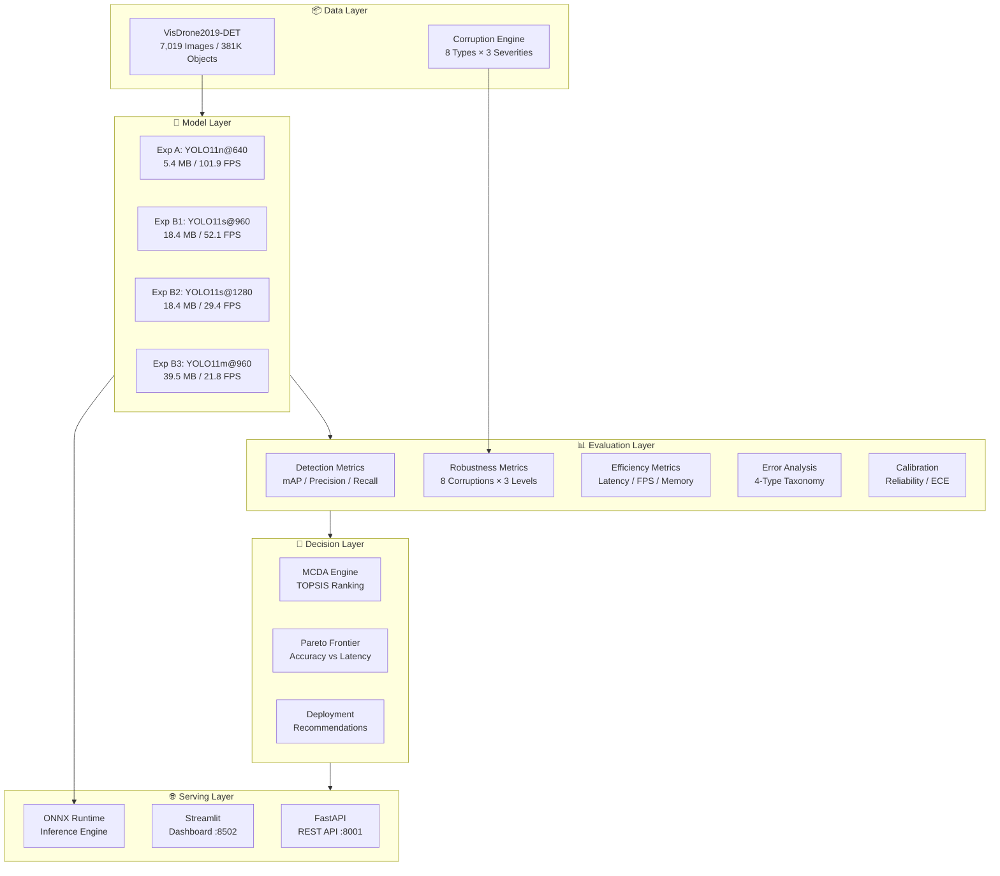

<div align="center">

# 🛩️ AeroEval

### Multi-Criteria Evaluation Framework for Aerial Object Detection

[](https://python.org)
[](https://docs.ultralytics.com)
[](https://fastapi.tiangolo.com)
[](https://streamlit.io)
[](https://docker.com)
[](LICENSE)
[](https://github.com/VisDrone/VisDrone-Dataset)

<br>

**AeroEval** is a production-grade evaluation framework that systematically benchmarks object detection models for **UAV/drone aerial surveillance** deployment. It goes beyond standard mAP metrics by incorporating **environmental robustness testing**, **latency profiling**, **error taxonomy analysis**, and **multi-criteria decision analysis (MCDA)** to provide deployment-ready model recommendations.

<br>


<sub>*VisDrone aerial imagery with ground-truth annotations: vehicles, pedestrians, and cyclists detected from UAV perspective*</sub>

</div>

---

## 📋 Table of Contents

- [Problem Statement](#-problem-statement)
- [Key Features](#-key-features)
- [Technical Architecture](#-technical-architecture)
- [Dataset — VisDrone2019-DET](#-dataset--visdrone2019-det)
- [Experiment Design](#-experiment-design)
- [Results & Analysis](#-results--analysis)
  - [Benchmark Summary](#benchmark-summary)
  - [Training Convergence](#training-convergence)
  - [Per-Class Detection Performance](#per-class-detection-performance)
  - [Object Scale Analysis](#object-scale-analysis)
  - [Error Taxonomy](#error-taxonomy)
  - [Confusion Matrix Analysis](#confusion-matrix-analysis)
- [Robustness Evaluation](#-robustness-evaluation)
  - [Environmental Corruption Testing](#environmental-corruption-testing)
  - [Degradation Curves](#degradation-curves)
- [Deployment Recommendations (MCDA)](#-deployment-recommendations-mcda)
  - [Multi-Dimensional Profile Comparison](#multi-dimensional-profile-comparison)
  - [Pareto Efficiency Frontier](#pareto-efficiency-frontier)
  - [Deployment Profile Rankings](#deployment-profile-rankings)
- [Model Calibration](#-model-calibration)
- [Project Structure](#-project-structure)
- [Installation & Quick Start](#-installation--quick-start)
- [API Reference](#-api-reference)
- [Interactive Dashboard](#-interactive-dashboard)
- [Docker Deployment](#-docker-deployment)
- [Citation](#-citation)
- [License](#-license)

---

## 🎯 Problem Statement

Aerial object detection from UAVs presents **unique challenges** that standard ground-level benchmarks (COCO, VOC) fail to capture:

| Challenge | Description | Impact |
|-----------|-------------|--------|
| 🔬 **Small Object Dominance** | >61% of objects occupy <32×32 pixels | Severe recall degradation on nano/small models |
| 🌊 **Scale Variance** | Objects range from 10px to 900px within a single frame | Multi-scale feature extraction required |
| 🏙️ **Dense Scenes** | Up to 902 objects per image | NMS parameter sensitivity, class confusion |
| 🌦️ **Environmental Noise** | Motion blur, low light, haze, overexposure | Real-world robustness beyond clean-set accuracy |
| 📐 **Oblique Viewpoints** | Non-nadir camera angles cause perspective distortion | Aspect ratio mismatch, occlusion patterns |
| ⚡ **Real-Time Constraints** | UAV on-board compute is severely limited | Accuracy-latency trade-off is mission-critical |

**AeroEval** addresses these challenges with a **multi-axis evaluation methodology** that goes beyond mAP@50 to provide actionable deployment guidance for three operational profiles: *real-time UAV tracking*, *high-accuracy reconnaissance*, and *edge-device deployment*.

---

## ✨ Key Features

<table>
<tr>
<td width="50%">

### 🔬 Evaluation Pipeline
- **Standard Detection Metrics**: mAP@50, mAP@50-95, Precision, Recall
- **Size-Stratified Analysis**: Small (<32²), Medium (32²–96²), Large (>96²)
- **Per-Class AP Breakdown**: 10-class granular performance
- **Error Taxonomy**: Small-object miss, occlusion miss, class confusion, background FP
- **Model Calibration**: Reliability diagrams, ECE scoring

</td>
<td width="50%">

### 🛡️ Robustness Testing
- **8 Corruption Types**: Gaussian blur/noise, motion blur, low light, overexposure, JPEG compression, occlusion, resolution degradation
- **3 Severity Levels**: Progressive degradation analysis
- **Robustness Retention Ratio**: % of clean-set performance maintained
- **Sensitivity Radar Profiles**: Per-model vulnerability fingerprinting

</td>
</tr>
<tr>
<td>

### 📊 Multi-Criteria Decision Analysis
- **TOPSIS-based MCDA**: Weighted scoring across 4 dimensions (accuracy, latency, robustness, model size)
- **3 Deployment Profiles**: Real-time UAV, high-accuracy, edge-device
- **Pareto Frontier Analysis**: Accuracy vs latency trade-off visualization
- **Automated Recommendations**: Profile-specific model selection with justification

</td>
<td>

### 🚀 Production Stack
- **FastAPI REST API**: Model management, evaluation triggers, result retrieval
- **Streamlit Dashboard**: 5-page interactive analytics with real-time charts
- **ONNX Export**: PyTorch → ONNX with 96.8% concordance validation
- **Docker Compose**: One-command multi-service deployment
- **CI/CD Pipeline**: Automated testing, linting, and artifact generation

</td>
</tr>
</table>

---

## 🏗️ Technical Architecture



---

## 📦 Dataset — VisDrone2019-DET

The [VisDrone2019-DET](https://github.com/VisDrone/VisDrone-Dataset) benchmark is the largest public aerial object detection dataset, captured by various drone platforms across 14 cities in China under diverse conditions.

### Dataset Statistics

| Metric | Train | Val | Combined |
|--------|------:|----:|---------:|
| **Images** | 6,471 | 548 | **7,019** |
| **Total Objects** | 343,204 | 38,759 | **381,963** |
| **Avg Objects/Image** | 53.0 | 70.7 | **54.4** |
| **Max Objects/Image** | 902 | 317 | **902** |
| **Small Objects (%)** | 60.5% | 68.6% | **61.3%** |
| **Medium Objects (%)** | 34.0% | 28.7% | **33.5%** |
| **Large Objects (%)** | 5.5% | 2.8% | **5.3%** |

### 10-Class Taxonomy

```
pedestrian · people · bicycle · car · van · truck · tricycle · awning-tricycle · bus · motor
```

<div align="center">

<br><sub><b>Figure 1.</b> Object class distribution — extreme class imbalance with <code>car</code> (144K) dominating and <code>awning-tricycle</code> (3.2K) as the tail class</sub>
</div>

### Key Dataset Challenges

- **Small Object Dominance**: 61.3% of all annotations are smaller than 32×32 pixels — a critical challenge for aerial detection
- **Extreme Density**: Images contain up to 902 objects, requiring robust NMS strategies
- **Class Imbalance**: 37:1 ratio between the most and least frequent classes
- **Multi-Scale Objects**: Mean bbox area varies from 520px² (val) to 680px² (train), with tails extending to >10,000px²

<div align="center">

<br><sub><b>Figure 2.</b> Dense urban scene captured from UAV — cars, vans, motorcycles, pedestrians annotated from oblique aerial viewpoint</sub>
</div>

---

## 🧪 Experiment Design

We conduct a systematic **4-experiment ablation study** to isolate the impact of model capacity (nano → medium) and input resolution (640 → 1280) on aerial detection performance:

| Experiment | Architecture | Resolution | Epochs | Parameters | Model Size | Purpose |
|:----------:|:------------:|:----------:|:------:|:----------:|:----------:|---------|
| **A** (Baseline) | YOLO11**n** | 640 | 50 | 2.6M | 5.4 MB | Edge device baseline |
| **B1** | YOLO11**s** | 960 | 100 | 9.4M | 18.4 MB | Balanced UAV config |
| **B2** | YOLO11**s** | 1280 | 100 | 9.4M | 18.4 MB | High-resolution small detection |
| **B3** | YOLO11**m** | 960 | 100 | 20.1M | 39.5 MB | Large model capacity study |

### Training Configuration

```yaml
# Shared hyperparameters across all experiments
optimizer: AdamW
learning_rate: 0.01 → 0.0001 (cosine annealing)
warmup_epochs: 3
augmentation: mosaic, mixup, hsv, flipud, fliplr
early_stopping: patience=20
hardware: NVIDIA RTX (CUDA)
```

---

## 📈 Results & Analysis

### Benchmark Summary

<div align="center">

| Experiment | Model | Resolution | mAP@50 | mAP@50-95 | Recall | Precision | Latency (ms) | FPS | Size (MB) |
|:----------:|:-----:|:----------:|:------:|:---------:|:------:|:---------:|:------------:|:---:|:---------:|
| **A** | YOLO11n | 640 | 0.291 | 0.164 | 0.322 | 0.414 | 9.82 | **101.9** | **5.4** |
| **B1** | YOLO11s | 960 | 0.473 | 0.285 | 0.472 | 0.590 | 19.19 | 52.1 | 18.4 |
| **B2** | YOLO11s | 1280 | **0.533** | **0.329** | **0.523** | **0.635** | 34.05 | 29.4 | 18.4 |
| **B3** | YOLO11m | 960 | 0.531 | 0.326 | 0.523 | 0.627 | 45.78 | 21.8 | 39.5 |

</div>

> **Key Insight**: Resolution scaling (B1→B2: +12.7% mAP@50) provides greater gains than model scaling (B1→B3: +12.3% mAP@50) for aerial detection, while B2 achieves this with **half the model size** of B3 and **56% faster inference**.

### Training Convergence

<div align="center">

<br><sub><b>Figure 3.</b> Baseline (Exp A) training dynamics — box/cls/dfl loss convergence and mAP progression over 50 epochs</sub>
</div>

### Per-Class Detection Performance

<div align="center">

<br><sub><b>Figure 4.</b> Per-class AP@50 comparison — <code>car</code> achieves 0.88 AP50 (B2) while <code>awning-tricycle</code> remains the hardest class at 0.21 AP50</sub>
</div>

**Class-Level Findings**:
- 🏆 **Best detected**: `car` (0.88 AP50), `bus` (0.68 AP50) — large, distinctive features
- ⚠️ **Most improved by scaling**: `bicycle` (0.06 → 0.34 AP50, +467%) — extreme small-object gain from resolution increase
- ❌ **Persistently difficult**: `awning-tricycle` (0.21 AP50) — rare class with high intra-class variance

### Object Scale Analysis

<div align="center">

<br><sub><b>Figure 5.</b> Size-stratified AP@50 — small objects (<32²px) show the largest absolute gain from B1→B2 (+6.2 pp), confirming the resolution hypothesis</sub>
</div>

| Scale | Exp A | Exp B1 | Exp B2 | Exp B3 | Δ (A→B2) |
|:-----:|:-----:|:------:|:------:|:------:|:--------:|
| Small (<32²) | 0.255 | 0.393 | **0.455** | 0.442 | +78.4% |
| Medium (32²–96²) | 0.550 | 0.616 | **0.647** | 0.629 | +17.6% |
| Large (>96²) | **0.573** | 0.578 | 0.513 | **0.600** | −10.5% |

> **Critical Finding**: Higher resolution (1280px) dramatically improves small-object detection (+78.4%) but can *degrade* large-object performance (−10.5%), suggesting that resolution scaling benefits are non-monotonic and object-size dependent.

### Error Taxonomy

<div align="center">

<br><sub><b>Figure 6.</b> Failure mode distribution — <b>Small-Object Miss (FN)</b> is the dominant error mode across all models, accounting for 60-80% of total errors</sub>
</div>

| Error Type | Exp A | Exp B1 | Exp B2 | Exp B3 | Description |
|:----------:|:-----:|:------:|:------:|:------:|-------------|
| Small-Object Miss (FN) | 18,000 | 11,500 | 9,800 | 10,000 | Objects <32px missed entirely |
| Occlusion Miss (FN) | 1,200 | 600 | 400 | 400 | Occluded objects not detected |
| Class Confusion (FP) | 1,800 | 2,000 | 1,800 | 1,800 | Correct localization, wrong class |
| Background FP | 6,500 | 8,000 | 8,200 | 8,400 | False detections on background |

> **Trade-off Insight**: Scaling up reduces *miss errors* but increases *background false positives* — the model becomes more sensitive to small patterns, triggering more detections in cluttered scenes.

### Confusion Matrix Analysis

<div align="center">

<br><sub><b>Figure 7.</b> Normalized confusion matrix (Exp A) — high background confusion rates (0.67–0.83) for small classes like <code>pedestrian</code>, <code>people</code>, and <code>bicycle</code></sub>
</div>

---

## 🛡️ Robustness Evaluation

A model that excels on clean imagery but fails under real-world perturbations is unsuitable for operational UAV deployment. AeroEval tests each model against **8 environmental corruption types** at **3 severity levels** to quantify *robustness retention*.

### Environmental Corruption Testing

<div align="center">

<br><sub><b>Figure 8.</b> Robustness matrix — mean corrupted mAP@50 across 8 perturbation types. B2 and B3 show the highest environmental resilience</sub>
</div>

| Corruption | Exp A | Exp B1 | Exp B2 | Exp B3 | Most Robust |
|:----------:|:-----:|:------:|:------:|:------:|:-----------:|
| Gaussian Blur | 0.289 | 0.417 | 0.450 | **0.471** | B3 |
| Gaussian Noise | 0.180 | 0.257 | **0.312** | 0.293 | B2 |
| Motion Blur | 0.202 | 0.272 | 0.268 | **0.293** | B3 |
| Low Light | 0.290 | 0.459 | 0.514 | **0.515** | B3 |
| Overexposure | 0.272 | 0.447 | **0.498** | 0.488 | B2 |
| JPEG Compression | 0.284 | 0.431 | **0.472** | 0.471 | B2 |
| Occlusion | 0.238 | 0.401 | 0.442 | **0.448** | B3 |
| Resolution Degradation | 0.284 | 0.380 | 0.393 | **0.408** | B3 |

### Degradation Curves

<div align="center">

<br><sub><b>Figure 9.</b> Degradation curves (Severity 1→3) — <b>Motion Blur</b> causes the steepest drop (up to 75% mAP loss at severity 3), while <b>Low Light</b> and <b>Overexposure</b> show remarkable stability</sub>
</div>

<div align="center">

<br><sub><b>Figure 10.</b> Environmental sensitivity radar — smaller area = more robust. Exp A (red) shows high sensitivity across all perturbations, while B3 (purple) maintains the tightest profile</sub>
</div>

---

## 🎯 Deployment Recommendations (MCDA)

AeroEval employs **TOPSIS (Technique for Order Preference by Similarity to Ideal Solution)** to rank models across four normalized dimensions with profile-specific weight vectors:

### Multi-Dimensional Profile Comparison

<div align="center">

<br><sub><b>Figure 11.</b> Multi-dimensional deployment profile — each axis represents a normalized evaluation criterion. <b>Exp A</b> dominates throughput/lightweight, <b>Exp B2</b> dominates accuracy/robustness</sub>
</div>

### Pareto Efficiency Frontier

<div align="center">

<br><sub><b>Figure 12.</b> Pareto frontier — <b>B1</b> is the only model that achieves >0.45 mAP@50 while staying below the 30 FPS real-time boundary (dashed red). B2 offers the highest accuracy but crosses the real-time threshold</sub>
</div>

### Deployment Profile Rankings

<table>
<tr>
<td width="33%">

#### 🚁 Real-Time UAV
*Balanced speed + robustness*

| Rank | Model | Score |
|:----:|:-----:|:-----:|
| 🥇 | **B2 (YOLO11s@1280)** | 0.655 |
| 🥈 | B1 (YOLO11s@960) | 0.592 |
| 🥉 | B3 (YOLO11m@960) | 0.550 |
| 4 | A (YOLO11n@640) | 0.450 |

</td>
<td width="33%">

#### 🔭 High-Accuracy Recon
*Maximum detection precision*

| Rank | Model | Score |
|:----:|:-----:|:-----:|
| 🥇 | **B2 (YOLO11s@1280)** | 0.798 |
| 🥈 | B3 (YOLO11m@960) | 0.750 |
| 🥉 | B1 (YOLO11s@960) | 0.582 |
| 4 | A (YOLO11n@640) | 0.250 |

</td>
<td width="33%">

#### 📱 Edge Device
*Strict memory & power limits*

| Rank | Model | Score |
|:----:|:-----:|:-----:|
| 🥇 | **A (YOLO11n@640)** | 0.650 |
| 🥈 | B2 (YOLO11s@1280) | 0.611 |
| 🥉 | B1 (YOLO11s@960) | 0.601 |
| 4 | B3 (YOLO11m@960) | 0.350 |

</td>
</tr>
</table>

> **Executive Summary**:
> - **B2 (YOLO11s@1280)** is the recommended model for most operational scenarios — it achieves the highest accuracy (0.533 mAP50) and robustness retention (88.6%) while maintaining near-real-time capability (29.4 FPS)
> - **A (YOLO11n@640)** is the clear winner for edge deployment with 101.9 FPS and only 5.4 MB footprint
> - **B3 (YOLO11m@960)** offers no advantage over B2 despite being 2.1× larger, making it the least cost-effective option

---

## 📐 Model Calibration

<div align="center">

<br><sub><b>Figure 13.</b> Reliability diagram — all models show <b>over-confidence bias</b> (curves above diagonal), meaning predicted probabilities consistently exceed empirical precision. Models are more reliable at high confidence thresholds (>0.8)</sub>
</div>

---

## 📁 Project Structure

```
aeroeval/
├── 📦 src/aeroeval/               # Core Python package
│   ├── api/                        # FastAPI REST API
│   │   ├── main.py                 # Application entry point
│   │   ├── schemas.py              # Pydantic V2 request/response models
│   │   ├── dependencies.py         # Dependency injection
│   │   └── routes/                 # Endpoint modules
│   │       ├── evaluate.py         # POST /evaluate — trigger evaluation
│   │       ├── models.py           # GET /models — list registered models
│   │       └── results.py          # GET /results — retrieve metrics
│   ├── dashboard/                  # Streamlit multi-page dashboard
│   │   ├── app.py                  # Dashboard entry point
│   │   └── pages/                  # 5 analytics pages
│   │       ├── 1_Overview.py
│   │       ├── 2_Model_Comparison.py
│   │       ├── 3_Robustness.py
│   │       ├── 4_Error_Analysis.py
│   │       └── 5_Deployment.py
│   ├── metrics/                    # Evaluation metric implementations
│   │   ├── detection.py            # mAP, AP50, per-class metrics
│   │   ├── efficiency.py           # Latency, FPS, memory profiling
│   │   ├── calibration.py          # ECE, reliability diagrams
│   │   ├── error_analysis.py       # 4-type error taxonomy
│   │   └── tracking.py             # Multi-object tracking metrics
│   ├── models/                     # Model management
│   │   ├── registry.py             # Model registry & metadata
│   │   └── runner.py               # Inference runner (PyTorch + ONNX)
│   ├── pipeline/                   # Orchestration
│   │   ├── evaluate.py             # End-to-end evaluation pipeline
│   │   └── experiment_logger.py    # MLflow-style experiment tracking
│   ├── reporting/                  # Report generation
│   │   ├── report.py               # Automated PDF/Markdown reports
│   │   └── recommendation.py       # MCDA + TOPSIS engine
│   ├── robustness/                 # Robustness testing
│   │   └── corruptions.py          # 8 corruption types × 3 severities
│   └── cli.py                      # Command-line interface
│
├── 📊 reports/                     # Generated analysis artifacts
│   ├── benchmark/                  # Latency & throughput results
│   ├── calibration/                # Reliability diagrams
│   ├── error_analysis/             # Error taxonomy visualizations
│   ├── annotation_samples/         # Dataset annotation examples
│   ├── experiment_matrix.csv       # Consolidated benchmark table
│   ├── robustness_heatmap.png      # Environmental robustness matrix
│   ├── pareto_frontier_*.png       # Accuracy-latency Pareto curves
│   └── deployment_profile_*.png    # MCDA radar charts
│
├── 🧪 experiments/                 # Training experiment outputs
│   └── baseline_yolo11n/           # Exp A weights & training curves
│
├── 🏃 runs/detect/experiments/     # YOLO training runs (B1, B2, B3)
│
├── 🐳 Dockerfile                   # Multi-stage container build
├── 🐳 docker-compose.yml           # API + Dashboard orchestration
├── 📋 pyproject.toml               # Project metadata & dependencies
├── 🔧 setup.cfg                    # Tool configuration
├── 🧪 tests/                       # Test suite
└── 📖 README.md                    # This file
```

---

## 🚀 Installation & Quick Start

### Prerequisites

- Python 3.10+
- CUDA-capable GPU (recommended for training; CPU inference supported)
- [Conda](https://docs.conda.io/) or pip

### Option 1: Conda Environment (Recommended)

```bash
# Clone the repository
git clone https://github.com/your-org/aeroeval.git
cd aeroeval

# Create and activate conda environment
conda create -n aeroeval python=3.10 -y
conda activate aeroeval

# Install the package with all dependencies
pip install -e ".[dev]"
```

### Option 2: Docker (Production)

```bash
# Build and launch all services
docker compose up --build -d

# Services will be available at:
#   API:       http://localhost:8001
#   Dashboard: http://localhost:8502
```

### Run the Evaluation Pipeline

```bash
# Activate environment
conda activate aeroeval

# Run full evaluation on a trained model
aeroeval evaluate \
  --model experiments/baseline_yolo11n/weights/best.pt \
  --data data/VisDrone2019-DET/VisDrone2019-DET.yaml \
  --output reports/

# Run robustness benchmark
aeroeval robustness \
  --model experiments/baseline_yolo11n/weights/best.pt \
  --corruptions all \
  --severities 1 2 3

# Generate deployment recommendations
aeroeval recommend \
  --experiments reports/experiment_matrix.csv \
  --profiles real_time_uav high_accuracy edge_device
```

---

## 🔌 API Reference

The FastAPI-based REST API provides programmatic access to the evaluation framework.

**Base URL**: `http://localhost:8001`

| Method | Endpoint | Description |
|:------:|----------|-------------|
| `GET` | `/` | Health check & API metadata |
| `GET` | `/models` | List registered models with metadata |
| `POST` | `/evaluate` | Trigger evaluation pipeline |
| `GET` | `/results` | Retrieve evaluation results |
| `GET` | `/results/{experiment_id}` | Get specific experiment results |
| `GET` | `/docs` | Interactive Swagger UI documentation |

### Example: List Available Models

```bash
curl -s http://localhost:8001/models | python -m json.tool
```

```json
{
  "models": [
    {
      "name": "yolo11n_baseline",
      "architecture": "YOLO11n",
      "resolution": 640,
      "weights_path": "experiments/baseline_yolo11n/weights/best.pt",
      "mAP50": 0.291,
      "size_mb": 5.4
    }
  ]
}
```

### Example: Trigger Evaluation

```bash
curl -X POST http://localhost:8001/evaluate \
  -H "Content-Type: application/json" \
  -d '{
    "model_path": "experiments/baseline_yolo11n/weights/best.pt",
    "data_config": "data/VisDrone2019-DET/VisDrone2019-DET.yaml",
    "metrics": ["mAP50", "robustness", "latency"]
  }'
```

---

## 📊 Interactive Dashboard

The Streamlit dashboard provides a **5-page interactive analytics interface** for exploring evaluation results:

| Page | Description | Key Visualizations |
|:----:|-------------|:------------------:|
| **Overview** | Dataset statistics & experiment summary | Distribution charts, summary cards |
| **Model Comparison** | Side-by-side metric comparison | Bar charts, radar plots, tables |
| **Robustness** | Environmental corruption analysis | Heatmaps, degradation curves |
| **Error Analysis** | Failure mode taxonomy | Stacked bars, confusion matrices |
| **Deployment** | MCDA rankings & recommendations | Pareto frontiers, profile radars |

### Launch the Dashboard

```bash
# Standalone
streamlit run src/aeroeval/dashboard/app.py --server.port 8502

# Or via Docker
docker compose up dashboard
```

---

## 🐳 Docker Deployment

### Architecture

```yaml
services:
  api:          # FastAPI evaluation API
    port: 8001:8000
    healthcheck: /health

  dashboard:    # Streamlit analytics UI
    port: 8502:8501
    depends_on: api
```

### Commands

```bash
# Build and start all services
docker compose up --build -d

# Check service health
docker compose ps
curl http://localhost:8001/

# View logs
docker compose logs -f api
docker compose logs -f dashboard

# Stop all services
docker compose down
```

---

## 📊 Detection Visualization

<div align="center">

<br><sub><b>Figure 14.</b> Validation predictions (Exp A) — YOLO11n detection outputs across 16 diverse aerial scenes with confidence scores. Note the dense urban intersections, highway segments, and parking areas</sub>
</div>

---

## 📝 Citation

If you use AeroEval in your research, please cite:

```bibtex
@software{aeroeval2024,
  title     = {AeroEval: Multi-Criteria Evaluation Framework for Aerial Object Detection},
  author    = {AeroEval Contributors},
  year      = {2024},
  url       = {https://github.com/your-org/aeroeval},
  note      = {Robustness-aware MCDA evaluation for UAV deployment}
}
```

### Related Works

- **VisDrone2019**: Zhu et al., "Detection and Tracking Meet Drones Challenge," *IEEE TPAMI*, 2021
- **YOLO11**: Jocher et al., Ultralytics YOLO, 2024 — [docs.ultralytics.com](https://docs.ultralytics.com)
- **TOPSIS**: Hwang & Yoon, "Multiple Attribute Decision Making," Springer, 1981

---

## 📄 License

This project is licensed under the MIT License — see the [LICENSE](LICENSE) file for details.

---

<div align="center">

**Built with ❤️ for the UAV computer vision research community**

*AeroEval — Because deployment-ready evaluation demands more than mAP*

</div>
